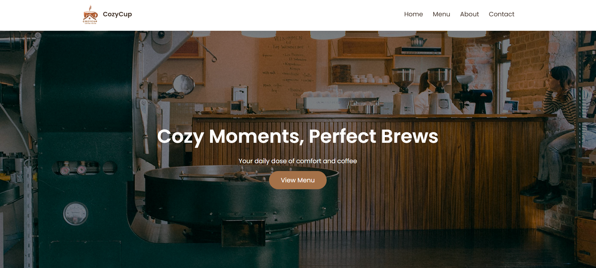
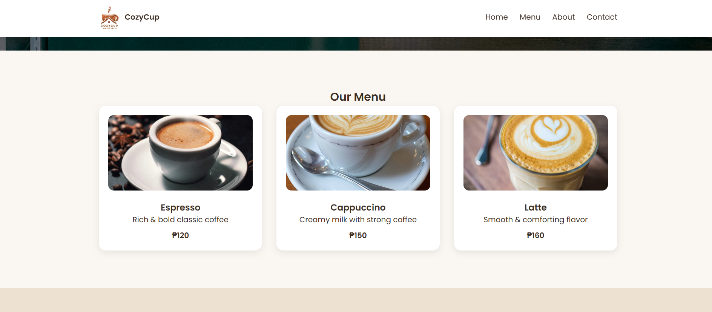
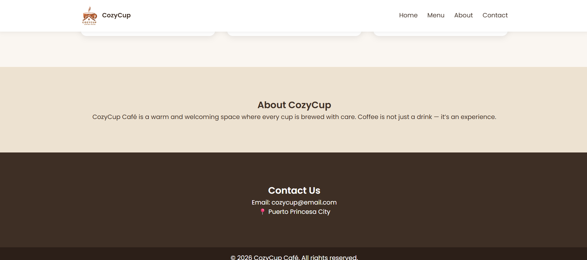

# Cozy Cup Cafe

## Project Description
Cozy Cup Cafe is a modern and cozy café website designed to showcase a coffee shop’s brand, menu, and contact information. The website provides a warm and welcoming online experience where users can explore featured coffee drinks, learn about the café, and easily find contact details.

---

## Features
- Clean and modern user interface
- Responsive navigation bar (Home, Menu, About, Contact)
- Hero section with café slogan and call-to-action button
- Menu section displaying coffee items with images, descriptions, and prices
- About section describing the café’s concept and atmosphere
- Contact section with email and location information

---

## Screen Captures

**Home Page** – Displays the CozyCup hero section with the slogan “Cozy Moments, Perfect Brews,” a background café image, and a call-to-action button.

**Menu Section** – Shows the café’s featured drinks including Espresso, Cappuccino, and Latte with images, descriptions, and prices.

**About Section** – Introduces CozyCup Café as a warm and welcoming space where every cup of coffee is brewed with care.

**Contact Section** – Displays the café’s contact email and location in Puerto Princesa City.

---

## About the Authors

**Name:** Althea Lauren  Villa | Collaborator  
**Email:** 202280369@psu.palawan.edu.ph

**Name:** Amy Almerida | Owner  
**Email:** 202380160@psu.palawan.edu.ph

